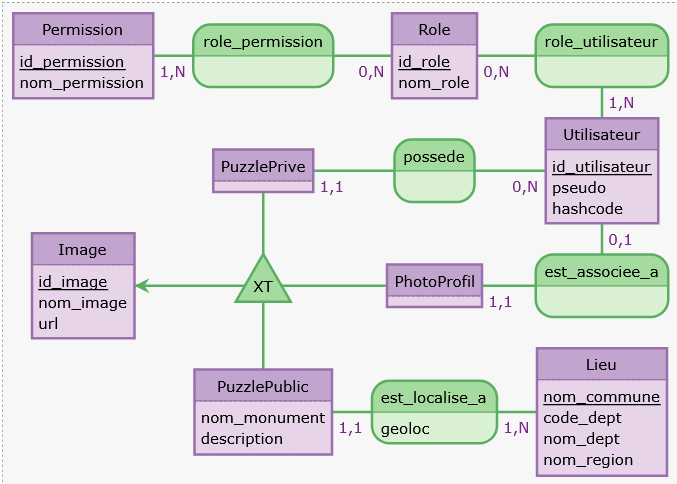

# GeoPuzzle


**GeoPuzzle** est une application web interactive mêlant découverte du patrimoine français et jeu de réflexion.

Le projet permet d'explorer la France via une carte interactive, de découvrir des monuments historiques, et de reconstituer des puzzles générés dynamiquement à partir d'images officielles ou personnelles.
Projet réalisé dans le cadre du cycle ingénieur informatique (S5, Polytech Lyon).

## Fonctionnalités

* **Exploration Interactive :** Carte de France SVG cliquable par départements.
* **Moteur de Puzzle :** Découpage dynamique d'images, rotation des pièces, système de "Drag & Drop".
* **Modes de Jeu :**
    * *Officiel :* Puzzles basés sur les monuments historiques (Base Mérimée).
    * *Personnel :* Upload de photos pour créer ses propres puzzles.
* **Système Utilisateur :** Inscription, connexion, gestion de profil et sauvegarde des scores.
* **Culture :** Fiches détaillées des monuments débloquées après victoire.

## Architecture Technique

* **Backend :** Python (FastAPI).
* **Base de données :** PostgreSQL (Hébergé sur NeonDB), connecteur `psycopg2`.
* **Frontend :** Templates Jinja2, Bootstrap 5, JavaScript Vanilla (Canvas API pour le découpage).
* **Architecture :** MVC (Modèle-Vue-Contrôleur).

### Conception



### Documentation
* [Présentation du projet](project-files/PresentationFinale.pdf)
* [Consignes](project-files/Consignes.pdf)

## Structure du Projet

```text
.
├── README.md
├── LICENSE
│
├── app/                      # Cœur de l'application
│   ├── requirements.txt      # Dépendances Python
│   ├── serveur.py            # Point d'entrée (App FastAPI)
│   ├── controllers/          # Logique de contrôle
│   ├── models/               # Requêtes SQL et Modèles Pydantic
│   └── view/                 # Interface Utilisateur
│       ├── templates/        # Vues Jinja2 (.tmpl)
│       └── css/js/img/       # Assets statiques
│
├── conception/               # Schémas relationnels et EA
├── data/                     # Script d'initialisation SQL et CSV
└── project-files/            # Rapports PDF
```

## Installation

1. **Environnement virtuel :**

```bash
cd app
python3 -m venv .venv
source .venv/bin/activate  # Linux/Mac
.venv\Scripts\Activate   # Windows
```

2. **Dépendances :**

```bash
pip install --upgrade pip
pip install -r requirements.txt
```

3. **Lancement :**

```bash
fastapi run serveur.py
```
L'application sera accessible sur `http://localhost:8000`.

## Auteurs

* **Matthias BOULLOT**
* **Timothée CAUCHY**
* **Marius CISERANE**
* **Francesco HO HUU--CAMPANELLI**
* **Valentin LAPORTE**

## Licence

Ce projet est sous licence MIT - voir le fichier [LICENSE](LICENSE) pour plus de détails.

> **Avertissement :** Ce projet utilise des données publiques du Ministère de la Culture (Base Mérimée). Les photographies des monuments restent la propriété de leurs auteurs respectifs.